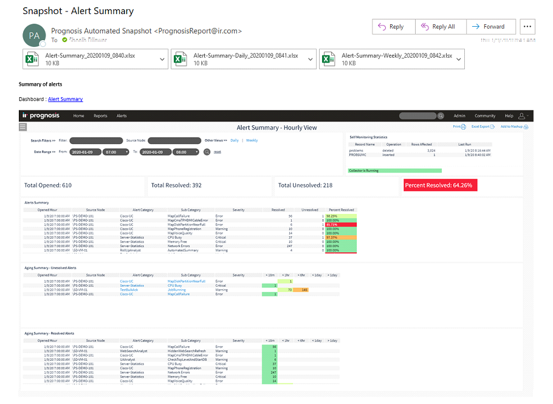

# Dashboard Scheduler & Mailer

Significant code files are located at _Dashboard-Mailer\Server\Configuration\Automation\Workflows\Dashboard Mailer_

*   [Dashboard Scheduler & Mailer](#dashboard-mailer)
*   [High Level Design](#hld)
*   [Package & Deployment](#deployment)
*   [Troubleshooting](#troubleshooting) 
    
<h2 id="dashboard-mailer">Dashboard Scheduler & Mailer</h2>
This Solution provides prognosis admins to configure and schedule an email to be sent out to specified recipients that include: 

* Screenshot of listed dashboards/reports. 
* Drilldown URL that takes you directly to dashboards/reports. 
* Excel export of each of listed dashboards/reports.

This Solution also provides the ability to define, modify and delete these profiles easily through web UI.

<h2 id="hld">High Level Design</h2>


<h2 id="deployment">Package & Deployment</h2>

The Dashboard Mailer solution is easy to deploy. Package contains:

* User Interface\My Displays & Configurations\Dashboard Mailer
   It contains the Dashboard Mailer dashboard that can be 'Send to Web' from GUI. It has a custom dashboard that contains scripts needed to trigger automation within the page.

* WebUI\IIS\
* Automation
   Dashboard Mailer Config automation that saves configurations from the webUI to server
* Administration
   REST Api object as well as dashboardmailer.json file that contains all the configurations.
* Server\Configuration\Automation
   Contains all the automation workflow files needed to capture and send emails.

To deploy:
1. Copy the contents into <Prognosis> directory and let windows merge the contents.
1. From WebUI\IIS\Administration\Config\RestApiDataSets_merge.xml copy the <dataset> tags and merge them into RestApiDataSets.xml. If there was already a dataset with <id> 'AutomationResults' as part of another customisation, we can skip this step.
1. IIS\PrognosisSite restart is likely required to get the views created (from step 2).
1. Get the node.js modules from [here]()
1.	Copy the content of Dashboard Mailer\Nodejs\node_modules into <Prognosis>\Server\Configuration\Automation\Workflows\Dashboard Mailer\node_modules directory.
1. In GUI open My Displays & Configurations\Dashboard Mailer
1. Right click on 'Dashboard Mailer' and choose 'Send to Web'
1. In PASSWORDS Conf, add a password entry. This user needs to have access to Prognosis WebUI
    ```
   AUTOMATION:dashboard-mailer	<domain\username>	<password>
    ```
1. Under navigation, in https://<ip>/prognosis/admin, add a key display as "Dashboard Mailer"
   
1. Add SMTP server details, make sure prognosis node has connectivity to the SMTP server.
1. Enter the name of the top level node where prognosis WebUI is being accessed into 'Save profiles On' text box.
   
1. Add New Profile
   1. Name the profile, e.g Avaya Health Check
   1. Semi Colon seperated recepients
   1. Navigate to the dashboard you are interested in and copy the URL (as-is) and hit Add Button.
   1. You can add multiple dashboards into a single profile. WebUI only allows a limited number of dashboards to be entered, however, more can be added manually by 5.editing the json file on the server.
   1. Schedule when to send the email, hourly, daily or day of the week.
   
1. Once all the profiles are created, make sure to 'Save Profiles To Disk', otherwise settings will be lost.
   
1. Wait for scheduled time and then verify that an email is sent. All attempts are listed on the 'Profile Emails Sent' window.
   
1. Manually configuring profiles.
   Profiles can be manually configured w/out using the above dashboard, for advanced scenarios. E.g if a large number of dashboards are needed in a single profile (WebUI only allows a limited number of dashboards per profile). Or configuring a custom schedule that WebUI doesn’t support.
   * Json formatted configuration file is located at "WebUI\IIS\Administration\Config\dashboardmailer.json"
```
{
    "dashboard_profiles": {
        "Avaya Health Check": {
            "dashboards": [
                "https://<server>/Prognosis/Dashboard/NT%20-%20CPU%20and%20Memory%20Central?DefaultNode=%5cPROG-NODE
                "https://<server>/Prognosis/Dashboard/<dashboard>?param=paramvalue&param2=param2"
            ],
            "dayofweek": "DAY",
            "email": "profile@domain.com",
            "timeofday": "07:00 08:00"
        }
    },
    "mail_from": "Prognosis Automated Snapshot <snapshot@ir.com>",
    "mail_server": "<SMTP-SERVER>",
    "save_to": "\\<Managing Node>"
}
```
   * "Avaya Health Check" is the profile name in above example
   * Dashboards is an array of dashboards included in the profile
   * Dayofweek, email and timeofday are schedule setting, if manually added, threshold also need to be updated.
   * To update schedule, modify the running ‘Dashobard-Mailer’ threshold
1. If it was successfully sent, you should receive the email with the snapshot of all dashboards and excel export of all the dashboards.
   

<h2 id="troubleshooting">Troubleshooting</h2>

#### Error loading profiles from the server?
   1. Verify that dashboardmailer.json file exists under WebUI\IIS\Administration\Config
   1. Verify that its not empty and/or the content is valid 'json' 
#### Error saving profiles to the server?
   1. Verify that REST API object 'AutomationResults' exists and available.
   1. Hit F12 in a browser (ideally Chrome) and under 'Network' tab verify what REST API requests its generating and what response it receives.
   1. Verify that your license has 'AUT' key
   1. Verify that Automation is enabled in PROGNOSIS conf (SET RUN (irAutomation.exe, Y))
#### Error sending emails?
   1. Verify that Dashboard Mailer threshold is started when saving profiles to server.
   1. Verify that prognosis triggers the automation on scheduled time by looking at open/closed problems and filter out on analyst name or rule name.
   1. Verify that profile mentioned in the threshold exists in the json file.
#### Debugging "Dashboard Mailer" Automaiton
   1. Check irdashboardmailer <profile name>.log file under Server\Configuration
   1. It could be the connectivity issue from prognosis server to the SMTP server.
   1. Verify that url and port used by prognosis is configured correctly.
   1. If not, get help from ir team.
#### Running automation manually
   1. Its always a good idea to send the email for a new profile just to yourself before sending it to the broader audience.
   1. To do so:
      1. Open the properties of running threshold 'Dashboard-Mailer' and go to Message Destination of a profile.
      1. Copy the Command content
      1. Open a command prompt to Server\configuration and paste the command and remove the send to log portion.
      1. cd Automation/Workflows && runwa.bat "Dashboard Mailer" "Avaya Health Check"
      1. This should trigger the automation to compose and send mail for Avaya Health Check profile.
      1. If there are any node.js errors, it may be missing node_modules, that would need to be copied into <Prongosis>\nodejs\node_modules
      1. It won’t be able to access password form prognosis (security), so you’d need to manually specify the credentials. Comment out the getCredentials line and uncomment the other section, as indicated below, in Server\Configuration\Automation\Workflows\Dashboard Mailer\workflow.js file.
```javascript
   // var creds = penv.getCredentials('dashboard-mailer');
   var creds = {        //for debugging
      user: 'administrator',
      password: 'Helpme1!',
   }
```
#### Emails are sent with incorrect contents
   1. Displays are blank? If prognosis did not get data in time or contains chart data, windows on the dashboard are likely to be empty. Making the dashboard persistent would help.
   1. Try to manually access the dashboards and verify if it takes a long time to populate data?
